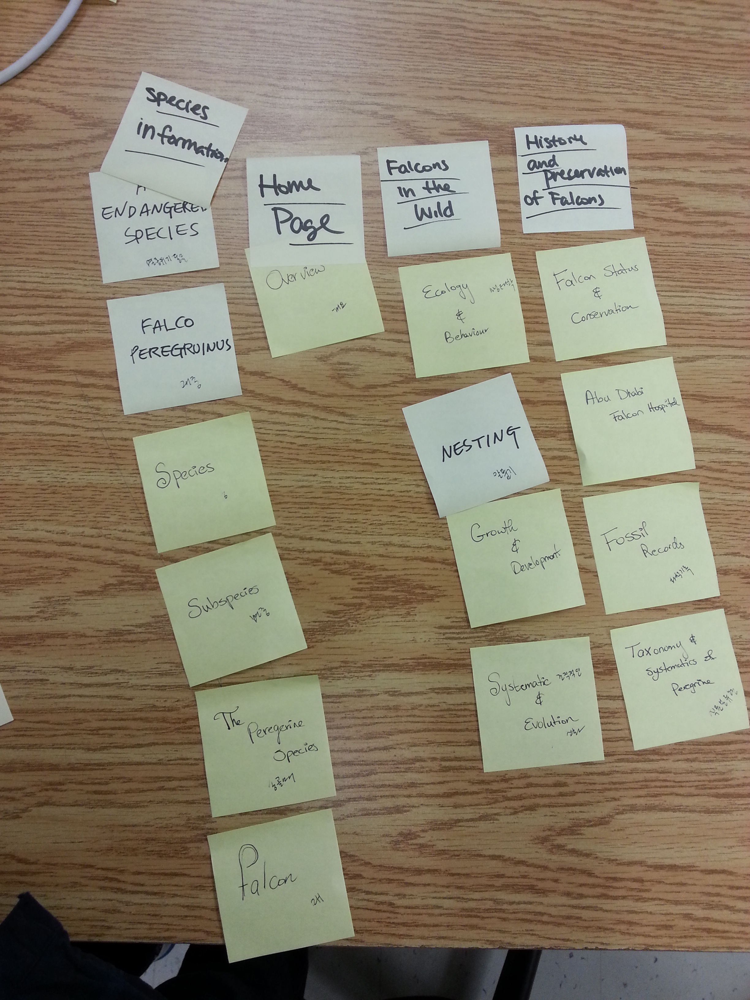
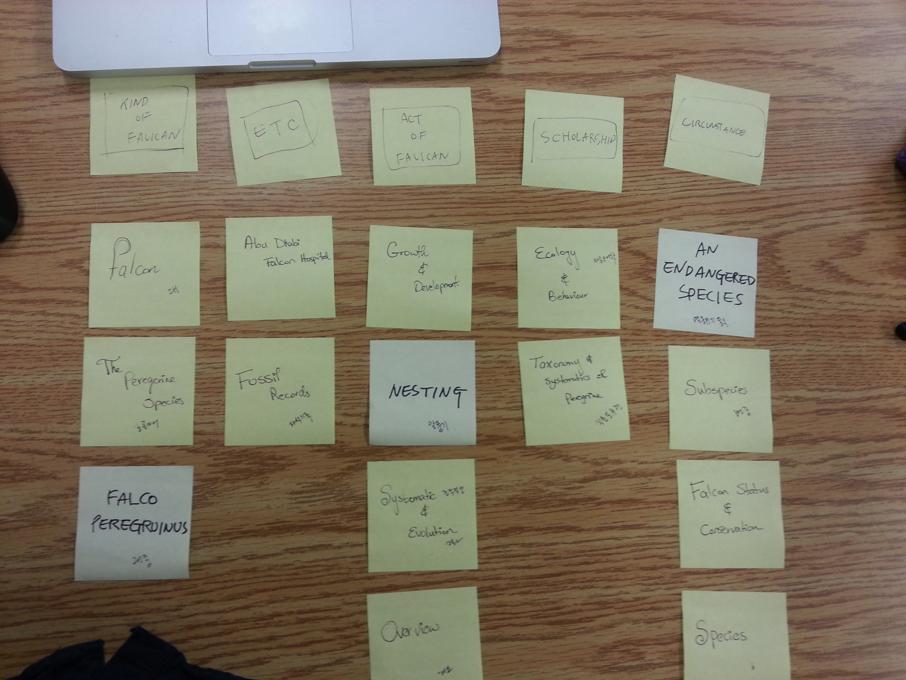

# Card sort report

The purpose of this card sort was to determine common navigation patterns and categories from the content of *Falcons*.

## Specifics

The card sort was conducted by Mariam Abdulwahab on october 12th, 2013 between the times of 4 and 6 with the following participants:

- Winnie Lau
- Kyounghee Lee

### Cards

15 cards were used covering a broad range of applicable content for the website. The following topics were used as cards:

1. Falcon
2. Systematics and evolution
3. Overview
4. Species
5. Fossil Records
6. The Peregrine Species
7. Falcon Status and Conservation
8. Growth and Development
9. Nesting
10. An endangered species
11. Falco Peregruinus
12. Taxonomy and systematics of peregrine
13. Subspecies
14. Ecology and behaviour
15. Abu Dhabi Falcon hospital

## Card sort results

*Card sort 1 by Winnie Lau*

*Card sort 2 by kyounghee Lee*

## Observations

- Did the participants have any common comments?
	- They both commented on the specific species of falcon called Peregerine.
- Did they find common groupings? Or were the groupings completely different?
	- There was one group that was common otherwise all the others where different.
- Were some of the groupings completely unexpected?
	- Not really.
- Were the results similar to your expectations?
	- Some of the results were similar to my expectations.
- How did you feel while watching them perform the task?
	- I felt curious about how they will sort them.